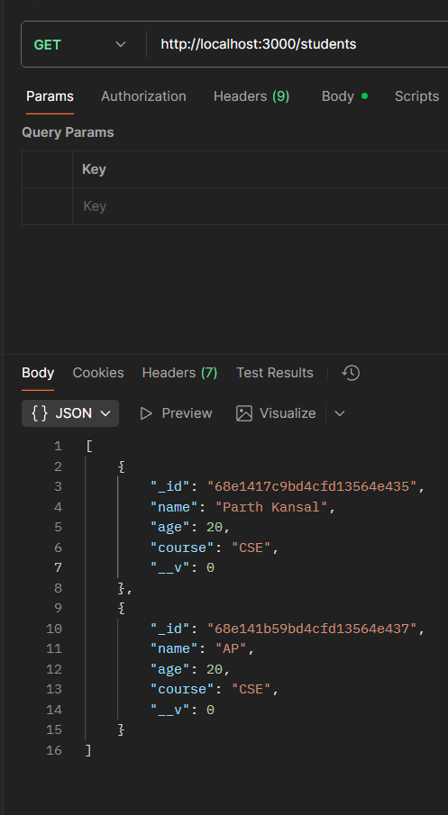
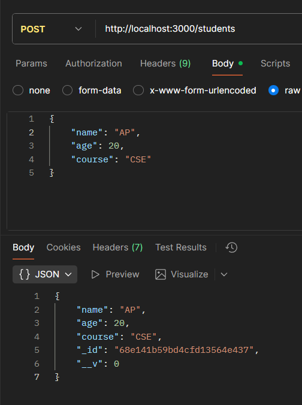
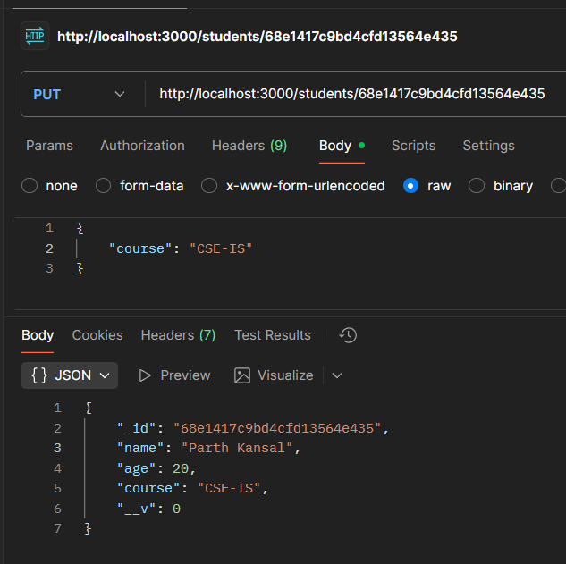
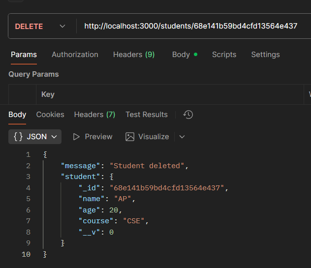

# Student Management System Using Node.js, Express, and MongoDB (MVC Architecture)
## Objective
Learn how to design and build a Node.js application using MVC architecture to manage student data stored in MongoDB. This experiment teaches:
- Separation of concerns (Model-View-Controller)
- Backend code organization
- CRUD operations using Mongoose

## Technologies Used
- Node.js
- Express.js
- MongoDB
- Mongoose
- Postman (for API testing)

## Folder Structure
```
student-management/
│
├─ models/
│   └─ Student.js
├─ controllers/
│   └─ studentController.js
├─ routes/
│   └─ studentRoutes.js
├─ server.js
└─ package.json
```
## Intialization
### 1. Initialize Node.js Project
```cmd
npm init -y
```
### 2. Install Dependencies
```cmd
npm install express mongoose
npm install --save-dev nodemon
```

## CODE

### 1. models/Student.js
```js
const mongoose = require('mongoose');

const studentSchema = new mongoose.Schema({
    name: { type: String, required: true },
    age: { type: Number, required: true },
    course: { type: String, required: true }
});

module.exports = mongoose.model('Student', studentSchema);

```

### 2. controllers/studentController.js
```js
const Student = require('../models/Student');

exports.getAllStudents = async (req, res) => {
    try {
        const students = await Student.find();
        res.status(200).json(students);
    } catch (err) {
        res.status(500).json({ message: err.message });
    }
};

exports.getStudentById = async (req, res) => {
    try {
        const student = await Student.findById(req.params.id);
        if (!student) return res.status(404).json({ message: 'Student not found' });
        res.status(200).json(student);
    } catch (err) {
        res.status(500).json({ message: err.message });
    }
};

exports.createStudent = async (req, res) => {
    const student = new Student({
        name: req.body.name,
        age: req.body.age,
        course: req.body.course
    });
    try {
        const newStudent = await student.save();
        res.status(201).json(newStudent);
    } catch (err) {
        res.status(400).json({ message: err.message });
    }
};

exports.updateStudent = async (req, res) => {
    try {
        const student = await Student.findByIdAndUpdate(req.params.id, req.body, { new: true });
        if (!student) return res.status(404).json({ message: 'Student not found' });
        res.status(200).json(student);
    } catch (err) {
        res.status(400).json({ message: err.message });
    }
};

exports.deleteStudent = async (req, res) => {
    try {
        const student = await Student.findByIdAndDelete(req.params.id);
        if (!student) return res.status(404).json({ message: 'Student not found' });
        res.status(200).json({ message: 'Student deleted', student });
    } catch (err) {
        res.status(500).json({ message: err.message });
    }
};
```

### 3. routes/studentRoutes.js
```js
const express = require('express');
const router = express.Router();
const studentController = require('../controllers/studentController');

router.get('/', studentController.getAllStudents);
router.get('/:id', studentController.getStudentById);
router.post('/', studentController.createStudent);
router.put('/:id', studentController.updateStudent);
router.delete('/:id', studentController.deleteStudent);

module.exports = router;
```

### 4. server.js
```js
const express = require('express');
const mongoose = require('mongoose');
const studentRoutes = require('./routes/studentRoutes');

const app = express();
const PORT = 3000;

// Middleware
app.use(express.json());

// Routes
app.use('/students', studentRoutes);

// MongoDB Connection
mongoose.connect('mongodb://127.0.0.1:27017/studentDB', { useNewUrlParser: true, useUnifiedTopology: true })
    .then(() => console.log('MongoDB connected'))
    .catch(err => console.log(err));

// Start Server
app.listen(PORT, () => {
    console.log(`Server running on http://localhost:${PORT}`);
});
```
### 5. package.json
```json
{
  "name": "student-management",
  "version": "1.0.0",
  "main": "server.js",
  "scripts": {
    "start": "node server.js",
    "dev": "nodemon server.js"
  },
  "dependencies": {
    "express": "^4.18.2",
    "mongoose": "^7.3.4"
  },
  "devDependencies": {
    "nodemon": "^3.0.1"
  }
}

```

## Commands to Run
```cmd
npm install
mongod   # Make sure MongoDB server is running
npm run dev   # Runs server with nodemon
```

## Test API Endpoints in Postman
| Method | Endpoint         | Description               |
|--------|------------------|---------------------------|
| GET    | /students        | Get all students          |
| GET    | /students/:id    | Get a student by ID       |
| POST   | /students        | Add a new student         |
| PUT    | /students/:id    | Update student by ID      |
| DELETE | /students/:id    | Delete student by ID      |

## SCREEN SHOT's
### 1. Get All Students (GET)


### 2. Add New Student (POST)


### 3. Update Student (PUT)


### 4. Delete Student (DELETE)


<p align="center">
    MADE by PARTH KANSAL 23BIS70035
</p>
